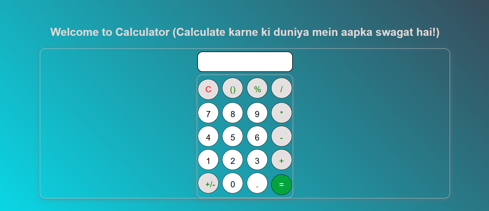

# Simple Calculator

A basic calculator app built using **HTML, CSS, and JavaScript**. It performs basic arithmetic operations such as addition, subtraction, multiplication, and division.

## Features
- Addition, Subtraction, Multiplication, Division and Modulus
- User-friendly interface
- Responsive design for different screen sizes

## Technologies Used
- **HTML** - Structure of the calculator
- **CSS** - Styling and layout
- **JavaScript** - Functional logic for calculations

## How to Use
1. Clone the repository:
   ```sh
   git clone https://github.com/aritra-mondal-it/Calculator-app.git
   ```
2. Navigate to the project folder:
   ```sh
   cd Calculator-app
   ```
3. Open `index.html` in your browser.

## File Structure
```
/simple-calculator
│── index.html      # Main HTML file
│── style.css       # Stylesheet for the app
│── utils.css       # Stylesheet for the text in app
│── script.js       # JavaScript file for calculator logic
└── README.md       # Documentation
```

## Demo
You can check out a live demo [https://calculator-app-by-aritra.netlify.app/]()

## Screenshot

